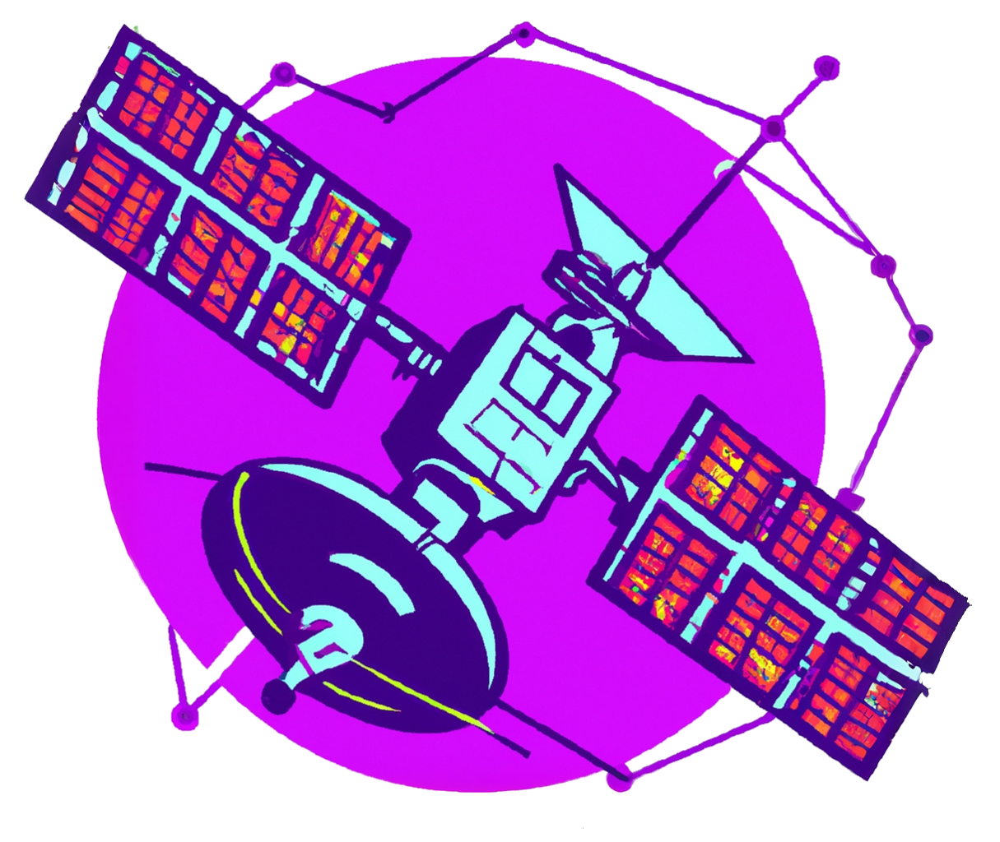

<h1 align="center" style="font-size: 48px;">Mir IoT Hub</h1>
<h3 align="center">Mir hub is the ultimate IoT hub solution for tommorow's interconnected world
</h3>
<h3 align="center">Develop easier. Connect faster. Scale quicker.
</h3>

 

  
  
   
  
  

# What is Mir Iot Hub?

Enable highly secure and reliable communication between your Internet of Things (IoT) application and your devices. Mir IoT Hub provides a cloud-hosted solution back end to connect virtually any device. Extend your solution from the cloud to the edge with per-device authentication, built-in device management, device telemetry and control, and scaled provisioning.

Mir IoT Hub, act as your command center:

- processes telemetry and commands with two ways communication
- automatically generate dashboards to view data and monitor devices and system
- digital twin for configuration management of individual devices
- lightweight and infinitely scalable

See the [documentation](https://book.mirhub.io/) for more information.

# Get Started

Follow the Quickstart documentation to have a running [Mir instance](https://book.mirhub.io/quick_start.html).

Follow up with your first device with the DeviceSDK [tutorial](https://book.mirhub.io/integrating_mir/device/device_sdk.html).

Go in-depth with the Mir CLI [tutorial](https://book.mirhub.io/operating_mir/mir_cli_tui.html).

To work on the Mir system, clone the repository and follow local setup [guide](https://book.mirhub.io/running_mir/local.html)

# License

Source code for MirHub is licensed under a Apache license 2.0
