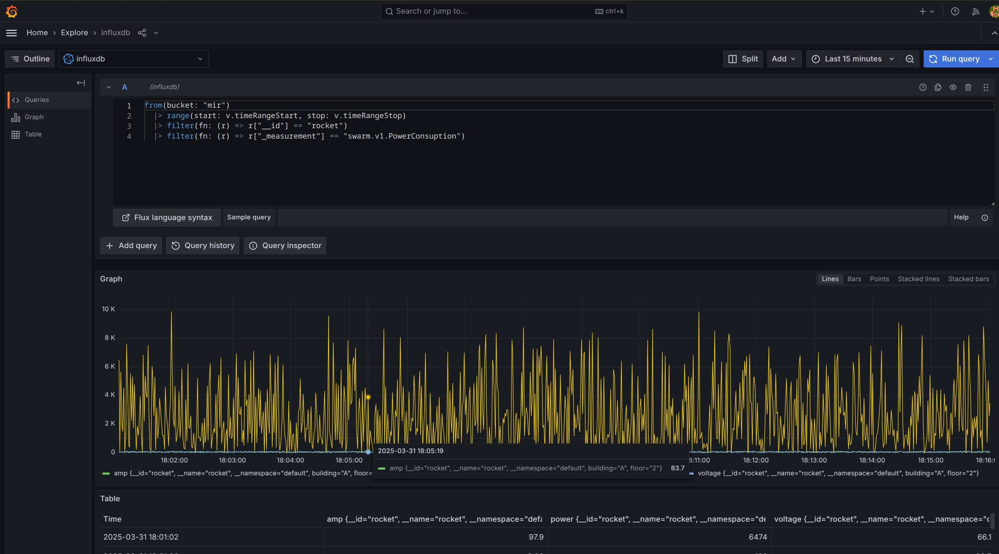
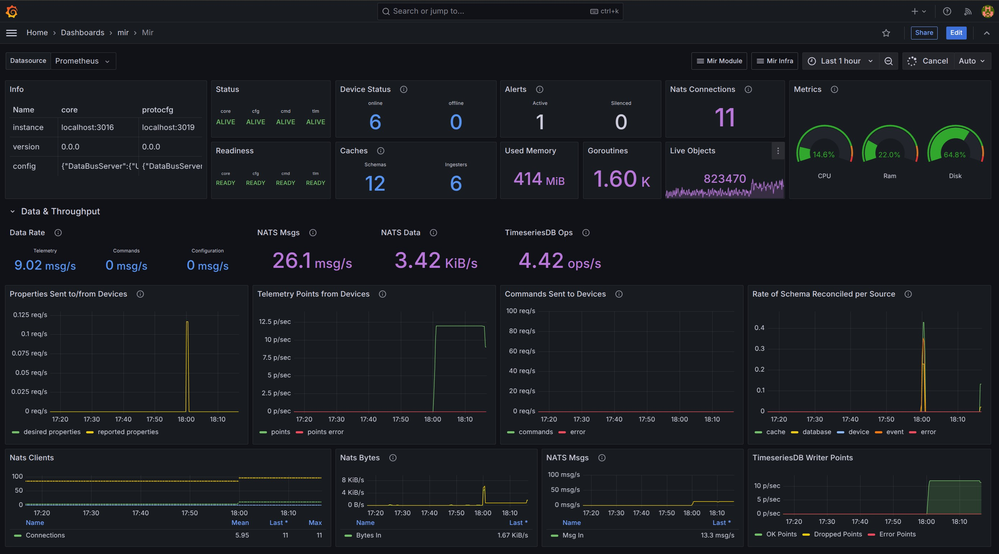

# Monitoring

To operate Mir effectively, it's essential to have a robust monitoring system in place. Grafana plays a crucial role in this process by providing a comprehensive monitoring solution for the Mir platform. It is used to display devices data as well as monitoring the health of the system.

What is Grafana?

[Grafana](https://grafana.com/) is an open-source analytics and interactive visualization web application. It's primarily used for data visualization, monitoring, and alerting. It provides a flexible and powerful platform for creating dashboards and visualizing metrics over time. It offers a wide range of features and integrations to help users monitor and analyze their data effectively.

The provided Grafana is configured to work with Mir's Prometheus server, SurrealDB, and InfluxDB.

## Display devices data

As explained in the [CLI](./mir_cli_tui.md) documentation, you can use the `mir dev tlm list` command to display devices data. The explore panel in Grafana is a great way to see telemetry as well as
offering an example of the query to see that data. Use the query as a starting point
to build powerful dashboards.

## Monitor the system

Dashboards are provided to monitor the health and performance of the different subsystems. They can be found under the Mir folder of the provided Grafana. There is a dashboard for each supporting infrastructure and services as well as overviews of the overall system health and performance. All the data are pulled from the Prometheus server used by Mir.

Moreover, Grafana allows you to create different alerts and notifications to keep you informed about any issues or anomalies in the system. You can set up alerts for specific metrics or conditions, and Grafana will notify you via email, Slack, or other channels when the alert is triggered.

