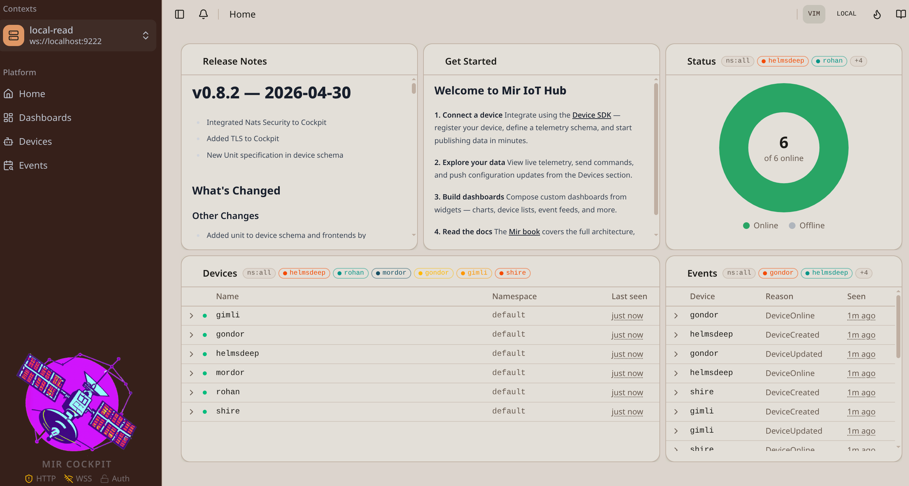

# Cockpit

Cockpit is Mir's web interface — a browser-based view of the platform with no separate deployment required.



---

### Dashboards

Fully customizable widget grid — drag, resize, and arrange tiles freely. The home page shows a pre-configured welcome dashboard; more can be created from the **Dashboards** section.

| | |
|---|---|
| Layout | Drag-and-drop widgets, read-only / edit mode toggle |
| Refresh | Auto-refresh with configurable interval |
| Persistence | Layouts saved across sessions |

### Device Fleet

Live table of all registered devices. Click any device to open its detail view across five tabs:

| Tab | Description |
|---|---|
| **Overview** | Digital twin — namespace, ID, labels, desired vs. reported properties |
| **Telemetry** | Interactive charts with field selector, time presets (1 min → 90 days), brush zoom, split views, data table, and Grafana link |
| **Commands** | Send commands with a syntax-highlighted JSON editor, dry-run validation, and a per-status response panel (`SUCCESS` `ERROR` `VALIDATED` `PENDING`) |
| **Configuration** | Edit config schemas, compare reported vs. desired values, dry-run before applying |
| **Events** | Device-scoped log of all interactions and state changes |

### Events

System-wide log of all platform activity — connections, commands, config changes, schema uploads. Supports pagination (up to 500 per page), time-range filtering, and UTC / local time toggle.

### Interface

| | |
|---|---|
| **Context Switcher** | Switch between Mir deployments from the header — one Cockpit can reach multiple servers |
| **Themes** | 7 built-in themes: **Dawn**, **Rust**, **Mocha**, **Dusk**, **Aurora**, **Midnight**, **Hacker** |
| **VIM Mode** | VIM keybindings for JSON payload editors — pass a small proficiency test to unlock (hint: `:q`) |
| **Time Display** | Toggle UTC / local time for all timestamps via the clock icon |
| **Docs Drawer** | In-app documentation covering Cockpit, CLI, and SDK development |

---

## 🚀 Operating Cockpit

### Accessing Cockpit

Have a Mir deployment ready:
- [Setup with Binary](../running_mir/binary.md)
- [Setup with Docker Compose](../running_mir/docker.md)
- [Setup with Kubernetes](../running_mir/kubernetes.md)

Once `mir` is running, open your browser at the configured port:

```
http://localhost:3015
```

Cockpit is a single-page application built with Svelte.

### 🔌 How It Connects

Cockpit does not connect to NATS directly over TCP — it uses a WebSocket connection defined by `webTarget` in your CLI contexts config (`~/.config/mir/cli.yaml`). This allows the browser to reach the NATS message bus through a standard WebSocket port.

```yaml
contexts:
  - name: local
    target: nats://localhost:4222      # used by the CLI
    webTarget: ws://localhost:9222     # used by Cockpit (browser)
    grafana: localhost:3000
```

| Key | Description |
|---|---|
| `target` | NATS TCP URL — used by the CLI and the Mir server itself |
| `webTarget` | WebSocket URL — used by the Cockpit browser client |
| `grafana` | Grafana base URL — powers "Open in Grafana" links on the telemetry page |

> If `webTarget` is not set, Cockpit falls back to `target` on port `9222`.

> Port `9222` is the NATS WebSocket listener — it is configured on the NATS server side, not by Cockpit itself.

### ⚙️ Configuration

Cockpit is configured in two files.

#### Server Config

Controls the HTTP server and Cockpit service behaviour:

```yaml
mir:
  http:
    port: 3015          # port Cockpit is served on
    tlsCert: ""         # path to TLS certificate (enables HTTPS)
    tlsKey: ""          # path to TLS private key
  cockpit:
    enabled: true
    allowedOrigins: []  # CORS allowed origins (empty = allow all)
    githubOwner: MaxThom
    githubRepo: mir
```

#### Contexts Config

Defines the servers Cockpit exposes to the browser:

```yaml
logLevel: info
currentContext: local
contexts:
  - name: local
    target: nats://localhost:4222
    webTarget: ws://localhost:9222
    grafana: localhost:3000
```

In Docker, these map to the two mounted config files:
- `./mir-compose/mir/local-config.yaml` → server config
- `./mir-compose/mir/local-contexts.yaml` → contexts config

> See [Docker Authentication](../security/auth-docker.md) for the full setup flow with authentication.

> See [Server-Only TLS](../security/tls-serveronly.md) for HTTPS and WSS setup.
