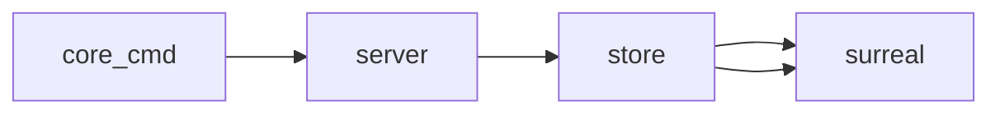

# Idea

- [ ] Unify cli, log and config for app into one Mir Service App object
      It could reuse the option pattern split between three subobjects. Now in the same package, they can start to share one anothers variables and functions
- [ ] To update any field for Surreal with protobuff, we could use a 	    map[string]string for the field name and value. This would allow us to update any field without needing to update the Surreal struct. This would be useful for the Surreal API so we can let the schema be extended by plugins and easier ergonomics for the dev. We could use a map[string]interface{} for the value, but this would require a type assertion to use the value. This would be a good idea if we wanted to use the value in a type specific way.

Another approach could be to send the entire json payload in a string. We could force the first object such as meta, spec, properties or status and let the value be open.

We could mix both, where we can speciy either a root field or any fields with dot notation. The value can be another direct value or a sub json object. Quite more open and flexible ergonomics for the different use case. CLI would be more with dot notation and straight values, while the API would be more with json objects.

Each request, has a security header allowing the user	 to specify only its allowed fields.


Should we have a dedicated API for Surreal with that protobuff concept or part of the core? I think it should be part of the core. With a dedicated set of endpoints for it. The core can keep its create and delete methods.
map[string]optional<string> so we can delete with null. The read method would be the same where you can request the entire object or a specific field.
- [ ] MirSrv, single binary that contains every
module part of Mir to run properly. Could simply have a set
of feature flags switch on or off the modules that are needed.
Integrate the cli and tui as well. They are top level and a
subcommand for server with the custom cli. We can create a
struct and inline the mir cmd
- [ ] Embedded database instead of Surreal. We could use BadgerDB, or else. Create an interface for surreal part of this work.

- [ ]



```sh
mir/
├── bin/
│   ├── mir
│   ├── protoflux
│   └── core
├── api/
│   ├── proto/
│   └── health/
├── cmd/
│   ├── cli/
│   │   └── main.go
│   ├── tui/
│   │   └── main.go
│   └── server/
│       └── main.go
├── internal/
│   ├── ui/
│   │   ├── cli/
│   │   │   └── cli.go
│   │   └── tui/
│   │       └── tui.go
│   ├── clients/
│   │   ├── core/
│   │   │   └── client.go
│   │   └── protoflux/
│   │       └── client.go
│   ├── services/
│   │   ├── core/
│   │   │   └── server.go
│   │   └── protoflux/
│   │       └── server.go
│   ├── ito/
│   │   ├── proto/ # generated code from proto files
│   │   └── core.go # contains code to transform from dto to ito and vice-versa
│   ├── externals/
│   │   ├── msg/
│   │   │   ├── interface.go # interface for natsio
│   │   │   ├── dto.go
│   │   │   └── natsio.go
│   │   ├── ts/
│   │   │   ├── interface.go # interface for timeseries db
│   │   │   ├── dto.go
│   │   │   ├── influxdb.go # private struct
│   │   │   └── questdb.go
│   │   └── mng/
│   │       ├── interface.go # interface for mng db
│   │       ├── dto.go
│   │       ├── surrealdb.go
│   │       └── bagder.go
│   └── libs/
│   │   ├── api/
│   │   │   └── health.go
│   │   ├── proto/
│   │   │   └── line_protocol.go
│   │   └── compression/
│   │       └── zstd.go
├── pkgs/
│   ├── models/
│   │   ├── telemetry/
│   │   │   └── telemetry.go
│   │   └── core/
│   │       └── device.go
│   ├── mir/
│   │   └── device/
│   │       └── mir.go
│   └── mir/
│       └── module/
│           └── mir.go
├── scripts/
│   ├── build.sh
│   └── deploy.sh
├── docs/
├── tools/
├── infra/
├── scripts/
└── README.md
```
